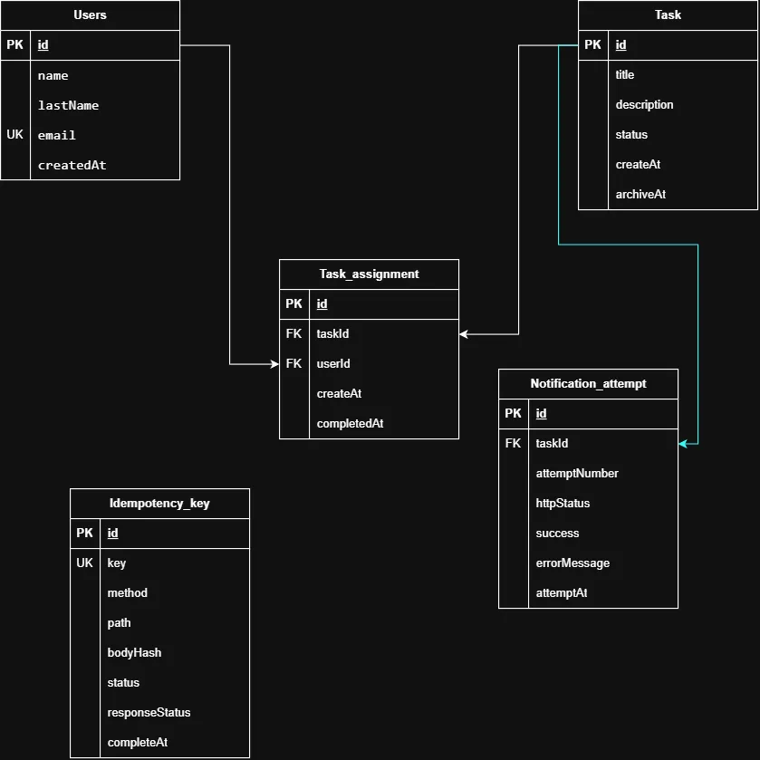

# Prueba Geest

Proyecto de asigancion de tareas

## Resumen

La api se encarga de Generar tareas y posteriormente ser asignadas a los usurios existentes

### Mejoras Realizads

- Se usa `Redis` + `BullMQ` como cola de reintentos para las notificaciones: cada intento agenda el
  siguiente como un job nuevo con backoff creciente (`NOTIFICATION_BACKOFF_MS`), hasta un máximo de
  3 intentos totales, tal como pide el reto. Cada intento queda registrado (número, timestamp,
  status HTTP) y se puede consultar en `GET /tasks/:idTask/notifications`.

- Asignacion de usuario desde el momento de la creacion de la tarea, ahora se puede asignar a un
  usuario desde el momento de la creacion de la tarea.
- Desasignar tarea, usando el mismo EP para asignar una tarea este te puede desasignar, si agregas
  un usuario que ya tiene la tarea asignada este se le desasignara.

### Publicacion de la API

- [geest-api](https://geest.veom.lat/) Se esta corriendo atraves de mi servidor casero usando Redis
  y Jenkins con un pipeline multibranch.

Se tomo esta decicion ya que una persona puede rentar su VPS y correr desde este mismo de la misma
forma ajustando la VPS a las necesidades del consumidor y poder Escalarla mejor.

### Diagrama

El UML se en cuentra en la carpeta data, se tiene una imagen como un archivo md mas explicativo.

- `docs\database-uml.md`



## Correr el proyecto

para correr el proyecto se puede hacer de 2 maneras diferente

- docker #Más recomendado
- manual

para cualquiera de estas opciones sera necesario llenar el `.env` pero el example ya tiene la
mayoria de los datos necesarios.

```sh
cp .env.example .env
```

### Caso: DOCKER

Se puededn prepararon los documentos `copose` tanto para `desarrollo` como para `produccion`

```sh
docker compose -f docker-compose.[ prod | dev ].yml
```

### Caso: Manul

```sh
pnpm i # Instalacion de dependencias
# Preparar las bases de datos tanto postgres como redis o
docker compose -f docker-compose.dev.yml up -d db redis # el env.example ya apunta a el

npx prisma migrate deploy # Correr migraciones
pnpm start:dev
```

## Tests

```bash
pnpm test          # unitarios
pnpm run test:e2e  # e2e contra Postgres y Redis reales
```

## License

Nest is [MIT licensed](https://github.com/nestjs/nest/blob/master/LICENSE).
