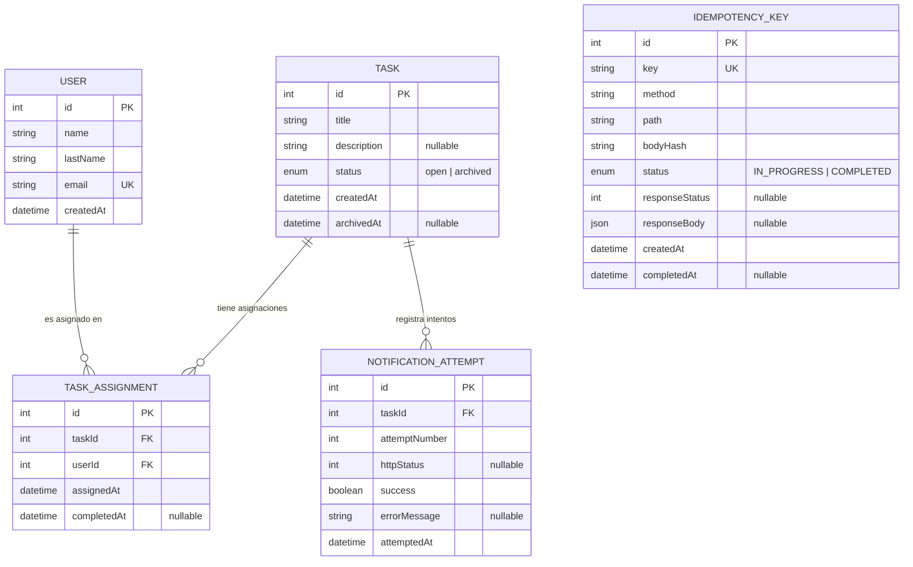

# UML — Estructura de la base de datos

Diagrama entidad-relación (PostgreSQL, gestionado con Prisma). Ver el esquema completo y versionado en [`prisma/schema.prisma`](../prisma/schema.prisma) y las migraciones en [`prisma/migrations/`](../prisma/migrations/).

## Notas

- `TASK_ASSIGNMENT` es la tabla de unión que resuelve la relación muchos-a-muchos entre `USER` y `TASK`, con `@@unique([taskId, userId])` para evitar asignaciones duplicadas, y `completedAt` (nullable) para marcar si ese usuario ya completó su parte.
- `TASK.status` es un enum (`open` | `archived`); la tarea se archiva automáticamente cuando ya no quedan `TASK_ASSIGNMENT` con `completedAt = NULL`.
- `NOTIFICATION_ATTEMPT` registra cada intento de notificación al archivar una tarea (número de intento, timestamp, status HTTP obtenido), consultable vía `GET /tasks/:idTask/notifications`.
- `IDEMPOTENCY_KEY` respalda el header `Idempotency-Key`: guarda el hash del cuerpo del request y la respuesta ya calculada, para que un reintento con la misma clave reciba una respuesta idéntica sin volver a ejecutar la operación.
- Todos los IDs son enteros autoincrementales (no UUID), para que coincidan con los ejemplos numéricos del enunciado (`userIds: [1,2,3]`, `taskId: 123`).
